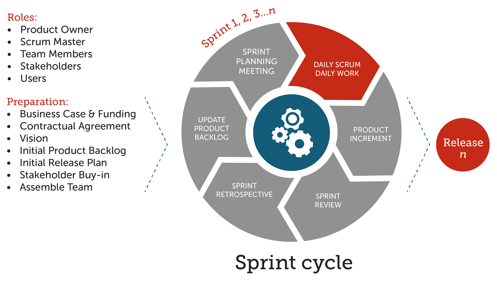
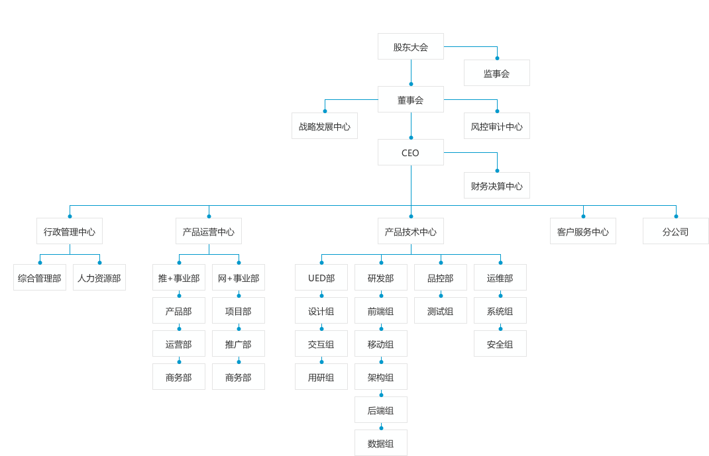
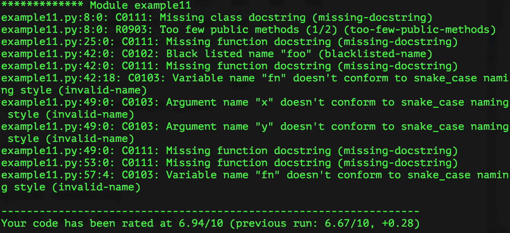
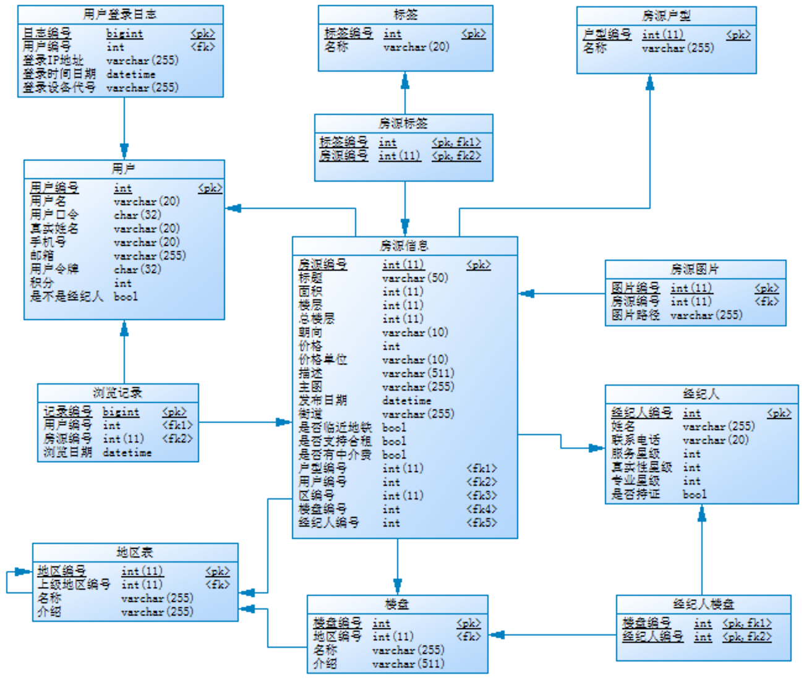

## CD-Python-JY-1806班项目阶段教学内容

### 开篇 - 就业形势分析

1. 就业方向

   - Python后端开发工程师（Python基础、Django、Flask、Tornado、RESTful、MySQL、Redis、MongoDB、ElasticSearch/Solr）
     - Web应用服务器 / 游戏后端服务器 / 移动端数据接口 / 系统支撑平台
   - Python爬虫开发工程师（Python基础、常用标准库和三方库、Scrapy/PySpider、Selenium/Appium、Redis、MySQL/MongoDB、前端相关知识、HTTP(S)、TCP/IP、Charles/Fiddler/Wireshark）
   - Python量化交易开发工程师（扎实的Python功底、数据结构和算法、金融知识、数字货币）
   - Python数据分析工程师（Python基础、NumPy/SciPy、Pandas、Matplotlib、机器学习算法）
   - Python自动化测试工程师（Python基础、软件测试基础、Linux、Shell、Selenium / Robot Framework、JMeter / LoadRunner / QTP、CI）
   - Python自动化运维工程师（Python基础、Linux、Shell、Docker、paramiko、Fabric、Ansible、Saltstack、Puppet、PlayBook、Zabbix）
   - Python云平台开发工程师（扎实的Python功底、OpenStack、CloudStack、Ovirt、KVM、微服务架构、Docker、K8S）

2. 面试加分项

   - 有自己的Github开源项目和博客。

   - 有分布式项目/微服务架构相关经验。（Nginx、LVS、Keepalived、Zookeeper、Docker）

   - 有项目性能调优和安全相关经验。（AB、WebBench、SysBench、JMeter、LoadRunner、QTP）

   - 有使用行业工具和中间件的经验。（Redis、FastDFS、RabbitMQ、Zabbix、Ansible、Nagios、ElasticSearch/Solr）

   - 熟悉前端开发相关的知识。（jQuery、Bootstrap、Vue.js、AngularJS）

   - 有其他语言开发经验（项目技术栈迁移能力）。（Java、C/C++）

   - 有大数据开发相关经验。（HDFS、YARN、MapReduce、HBase、Hive、Mahout、Pig、Spark、ZooKeeper）

     

### 第01-02天：白板编程练习

1. 数据结构和算法

   - 算法：解决问题的方法和步骤
   - 评价算法的好坏：渐近时间复杂度和渐近空间复杂度。
   - 渐近时间复杂度的大O标记：
     - $O(c)$ - 常量时间复杂度 - 布隆过滤器 / 哈希存储
     - $O(log_2n)$ - 对数时间复杂度 - 折半查找（二分查找）
     - $O(n)$ - 线性时间复杂度 - 顺序查找 / 桶排序
     - $O(n*log_2n)$ - 对数线性时间复杂度 - 高级排序算法（归并排序、快速排序）
     - $O(n^2)$ - 平方时间复杂度 - 简单排序算法（选择排序、插入排序、冒泡排序）
     - $O(n^3)$ - 立方时间复杂度 - Floyd算法 / 矩阵乘法运算
     - $O(2^n)$ - 几何级数时间复杂度 - 汉诺塔
     - $O(n!)$ - 阶乘时间复杂度 - 旅行经销商问题 - NP

   - 排序算法（选择、冒泡和归并）和查找算法（顺序和折半）

     ```Python
     def select_sort(origin_items, comp=lambda x, y: x < y):
         """简单选择排序"""
         items = origin_items[:]
         for i in range(len(items) - 1):
             min_index = i
             for j in range(i + 1, len(items)):
                 if comp(items[j], items[min_index]):
                     min_index = j
             items[i], items[min_index] = items[min_index], items[i]
         return items
     ```

     ```Python
     def bubble_sort(origin_items, comp=lambda x, y: x > y):
         """高质量冒泡排序(搅拌排序)"""
         items = origin_items[:]
         for i in range(len(items) - 1):
             swapped = False
             for j in range(i, len(items) - 1 - i):
                 if comp(items[j], items[j + 1]):
                     items[j], items[j + 1] = items[j + 1], items[j]
                     swapped = True
             if swapped:
                 swapped = False
                 for j in range(len(items) - 2 - i, i, -1):
                     if comp(items[j - 1], items[j]):
                         items[j], items[j - 1] = items[j - 1], items[j]
                         swapped = True
             if not swapped:
                 break
         return items
     ```

     ```Python
     def merge_sort(items, comp=lambda x, y: x <= y):
         """归并排序(分治法)"""
         if len(items) < 2:
             return items[:]
         mid = len(items) // 2
         left = merge_sort(items[:mid], comp)
         right = merge_sort(items[mid:], comp)
         return merge(left, right, comp)
     
     
     def merge(items1, items2, comp):
         """合并(将两个有序的列表合并成一个有序的列表)"""
         items = []
         index, index2 = 0, 0
         while index1 < len(items1) and index2 < len(items2):
             if comp(items1[index1], items2[index2]):
                 items.append(items1[index1])
                 index1 += 1
             else:
                 items.append(items2[index2])
                 index2 += 1
         items += items1[index1:]
         items += items2[index2:]
         return items
     ```

     ```Python
     def seq_search(items, key):
         """顺序查找"""
         for index, item in enumerate(items):
             if item == key:
                 return index
         return -1
     ```

     ```Python
     def bin_search(items, key):
         """折半查找"""
         start, end = 0, len(items) - 1
         while start <= end:
             mid = (start + end) // 2
             if key > items[mid]:
                 start = mid + 1
             elif key < items[mid]:
                 end = mid - 1
             else:
                 return mid
         return -1
     ```

   - 使用生成式（推导式）语法

     ```Python
     prices = {
         'AAPL': 191.88,
         'GOOG': 1186.96,
         'IBM': 149.24,
         'ORCL': 48.44,
         'ACN': 166.89,
         'FB': 208.09,
         'SYMC': 21.29
     }
     # 用股票价格大于100元的股票构造一个新的字典
     prices2 = {key: value for key, value in prices.items() if value > 100}
     print(prices2)
     ```

   - 嵌套的列表

     ```Python
     names = ['关羽', '张飞', '赵云', '马超', '黄忠']
     courses = ['语文', '数学', '英语']
     # 录入五个学生三门课程的成绩
     # 错误 - 参考http://pythontutor.com/visualize.html#mode=edit
     # scores = [[None] * len(courses)] * len(names)
     scores = [[None] * len(courses) for _ in range(len(names))]
     for row, name in enumerate(names):
         for col, course in enumerate(courses):
             scores[row][col] = float(input(f'请输入{name}的{course}成绩: '))
             print(scores)
     ```

     [Python Tutor](http://pythontutor.com/) - VISUALIZE CODE AND GET LIVE HELP

   - heapq、itertools等的用法
     ```Python
     """
     从列表中找出最大的或最小的N个元素
     """
     import heapq
     
     list1 = [34, 25, 12, 99, 87, 63, 58, 78, 88, 92]
     list2 = [
         {'name': 'IBM', 'shares': 100, 'price': 91.1},
         {'name': 'AAPL', 'shares': 50, 'price': 543.22},
         {'name': 'FB', 'shares': 200, 'price': 21.09},
         {'name': 'HPQ', 'shares': 35, 'price': 31.75},
         {'name': 'YHOO', 'shares': 45, 'price': 16.35},
         {'name': 'ACME', 'shares': 75, 'price': 115.65}
     ]
     print(heapq.nlargest(3, list1))
     print(heapq.nsmallest(3, list1))
     print(heapq.nlargest(2, list2, key=lambda x: x['price']))
     print(heapq.nlargest(2, list2, key=lambda x: x['shares']))
     ```

     ```Python
     """
     排列 / 组合 / 笛卡尔积
     """
     import itertools
     
     itertools.permutations('ABCD')
     itertools.combinations('ABCDE', 3)
     itertools.product('ABCD', '123')
     ```

   - collections模块下的工具类

     ```Python
     """
     找出序列中出现次数最多的元素
     """
     from collections import Counter
     
     words = [
         'look', 'into', 'my', 'eyes', 'look', 'into', 'my', 'eyes',
         'the', 'eyes', 'the', 'eyes', 'the', 'eyes', 'not', 'around',
         'the', 'eyes', "don't", 'look', 'around', 'the', 'eyes',
         'look', 'into', 'my', 'eyes', "you're", 'under'
     ]
     counter = Counter(words)
     print(counter.most_common(3))
     ```

   - 常用算法：

     - 穷举法 - 又称为暴力破解法，对所有的可能性进行验证，直到找到正确答案。
     - 贪婪法 - 在对问题求解时，总是做出在当前看来是最好的选择，不追求最优解，快速找到满意解。
     - 分治法 - 把一个复杂的问题分成两个或更多的相同或相似的子问题，再把子问题分成更小的子问题，直到可以直接求解的程度，最后将子问题的解进行合并得到原问题的解。
     - 回溯法 - 回溯法又称为试探法，按选优条件向前搜索，当搜索到某一步发现原先选择并不优或达不到目标时，就退回一步重新选择。
     - 动态规划 - 基本思想也是将待求解问题分解成若干个子问题，先求解并保存这些子问题的解，避免产生大量的重复运算。

     穷举法例子：百钱百鸡和五人分鱼。

     ```Python
     # 公鸡5元一只 母鸡3元一只 小鸡1元三只
     # 用100元买100只鸡 问公鸡/母鸡/小鸡各多少只
     for x in range(20):
         for y in range(33):
             z = 100 - x - y
             if 5 * x + 3 * y + z // 3 == 100 and z % 3 == 0:
                 print(x, y, z)
     
     # A、B、C、D、E五人在某天夜里合伙捕鱼 最后疲惫不堪各自睡觉
     # 第二天A第一个醒来 他将鱼分为5份 扔掉多余的1条 拿走自己的一份
     # B第二个醒来 也将鱼分为5份 扔掉多余的1条 拿走自己的一份
     # 然后C、D、E依次醒来也按同样的方式分鱼 问他们至少捕了多少条鱼
     fish = 1
     while True:
         total = fish
         enough = True
         for _ in range(5):
             if (total - 1) % 5 == 0:
                 total = (total - 1) // 5 * 4
             else:
                 enough = False
                 break
         if enough:
             print(fish)
             break
         fish += 1
     ```

     贪婪法例子：假设小偷有一个背包，最多能装20公斤赃物，他闯入一户人家，发现如下表所示的物品。很显然，他不能把所有物品都装进背包，所以必须确定拿走哪些物品，留下哪些物品。

     |  名称  | 价格（美元） | 重量（kg） |
     | :----: | :----------: | :--------: |
     |  电脑  |     200      |     20     |
     | 收音机 |      20      |     4      |
     |   钟   |     175      |     10     |
     |  花瓶  |      50      |     2      |
     |   书   |      10      |     1      |
     |  油画  |      90      |     9      |

     ```Python
     """
     贪婪法：在对问题求解时，总是做出在当前看来是最好的选择，不追求最优解，快速找到满意解。
     输入：
     20 6
     电脑 200 20
     收音机 20 4
     钟 175 10
     花瓶 50 2
     书 10 1
     油画 90 9
     """
     class Thing(object):
         """物品"""
     
         def __init__(self, name, price, weight):
             self.name = name
             self.price = price
             self.weight = weight
     
         @property
         def value(self):
             """价格重量比"""
             return self.price / self.weight
     
     
     def input_thing():
         """输入物品信息"""
         name_str, price_str, weight_str = input().split()
         return name_str, int(price_str), int(weight_str)
     
     
     def main():
         """主函数"""
         max_weight, num_of_things = map(int, input().split())
         all_things = []
         for _ in range(num_of_things):
             all_things.append(Thing(*input_thing()))
         all_things.sort(key=lambda x: x.value, reverse=True)
         total_weight = 0
         total_price = 0
         for thing in all_things:
             if total_weight + thing.weight <= max_weight:
                 print(f'小偷拿走了{thing.name}')
                 total_weight += thing.weight
                 total_price += thing.price
         print(f'总价值: {total_price}美元')
     
     
     if __name__ == '__main__':
         main()
     ```

     分治法例子：快速排序。

     ```Python
     def quick_sort(origin_items, comp=lambda x, y: x <= y):
         """快速排序"""
         items = origin_items[:]
         _quick_sort(items, 0, len(items) - 1, comp)
         return items
     
     
     def _quick_sort(items, start, end, comp):
         if start < end:
             pos = _partition(items, start, end, comp)
             _quick_sort(items, start, pos - 1, comp)
             _quick_sort(items, pos + 1, end, comp)
     
     
     def _partition(items, start, end, comp):
         pivot = items[end]
         i = start - 1
         for j in range(start, end):
             if comp(items[j], pivot):
                 i += 1
                 items[i], items[j] = items[j], items[i]
         items[i + 1], items[end] = items[end], items[i + 1]
         return i + 1
     ```

     回溯法例子：骑士巡逻。

     ```Python
     """
     递归回溯法：叫称为试探法，按选优条件向前搜索，当搜索到某一步，发现原先选择并不优或达不到目标时，就退回一步重新选择，比较经典的问题包括骑士巡逻、八皇后和迷宫寻路等。
     """
     import sys
     import time
     
     SIZE = 5
     total = 0
     
     
     def print_board(board):
         for row in board:
             for col in row:
                 print(str(col).center(4), end='')
             print()
     
     
     def patrol(board, row, col, step=1):
         if row >= 0 and row < SIZE and \
             col >= 0 and col < SIZE and \
             board[row][col] == 0:
             board[row][col] = step
             if step == SIZE * SIZE:
                 global total
                 total += 1
                 print(f'第{total}种走法: ')
                 print_board(board)
             patrol(board, row - 2, col - 1, step + 1)
             patrol(board, row - 1, col - 2, step + 1)
             patrol(board, row + 1, col - 2, step + 1)
             patrol(board, row + 2, col - 1, step + 1)
             patrol(board, row + 2, col + 1, step + 1)
             patrol(board, row + 1, col + 2, step + 1)
             patrol(board, row - 1, col + 2, step + 1)
             patrol(board, row - 2, col + 1, step + 1)
             board[row][col] = 0
     
     
     def main():
         board = [[0] * SIZE for _ in range(SIZE)]
         patrol(board, SIZE - 1, SIZE - 1)
     
     
     if __name__ == '__main__':
         main()
     ```

     动态规划例子：再论斐波拉切数列。

     ```Python
     """
     动态规划 - 适用于有重叠子问题和最优子结构性质的问题
     使用动态规划方法所耗时间往往远少于朴素解法(用空间换取时间)
     """
     
     
     def fib(num, temp={}):
         """用递归计算Fibonacci数"""
         if num in (1, 2):
             return 1
         try:
             return temp[num]
         except KeyError:
             temp[num] = fib(num - 1) + fib(num - 2)
             return temp[num]
     ```

2. 函数的使用方式

   - 将函数视为“一等公民”

     - 函数可以赋值给变量
     - 函数可以作为函数的参数
     - 函数可以作为函数的返回值

   - 高阶函数的用法（`filter`、`map`以及它们的替代品）

     ```Python
     items1 = list(map(lambda x: x ** 2, filter(lambda x: x % 2, [1, 2, 3, 4, 5, 6, 7, 8, 9])))
     items2 = [x ** 2 for x in range(1, 10) if x % 2]
     ```

   - 位置参数、可变参数、关键字参数、命名关键字参数

   - 参数的元信息（代码可读性问题）

   - 匿名函数和内联函数的用法（`lambda`函数）

   - 闭包和作用域问题

     - Python搜索变量的LEGB顺序（Local --> Embedded --> Global --> Built-in）

     - `global`和`nonlocal`关键字的作用

       `global`：声明或定义全局变量（要么直接使用现有的全局作用域的变量，要么定义一个变量放到全局作用域）。

       `nonlocal`：声明使用嵌套作用域的变量（嵌套作用域必须存在该变量，否则报错）。

   - 装饰器函数（使用装饰器和取消装饰器）

     例子：输出函数执行时间的装饰器。

     ```Python
     def record_time(func):
         """自定义装饰函数的装饰器"""
         
         @wraps(func)
         def wrapper(*args, **kwargs):
             start = time()
             result = func(*args, **kwargs)
             print(f'{func.__name__}: {time() - start}秒')
             return result
             
         return wrapper
     ```

     如果装饰器不希望跟`print`函数耦合，可以编写带参数的装饰器。

     ```Python
     from functools import wraps
     from time import time
     
     
     def record(output):
         """自定义带参数的装饰器"""
     	
     	def decorate(func):
     		
     		@wraps(func)
     		def wrapper(*args, **kwargs):
     			start = time()
     			result = func(*args, **kwargs)
     			output(func.__name__, time() - start)
     			return result
                 
     		return wrapper
     	
     	return decorate
     ```

     ```Python
     from functools import wraps
     from time import time
     
     
     class Record(object):
         """自定义装饰器类(通过__call__魔术方法使得对象可以当成函数调用)"""
     
         def __init__(self, output):
             self.output = output
     
         def __call__(self, func):
     
             @wraps(func)
             def wrapper(*args, **kwargs):
                 start = time()
                 result = func(*args, **kwargs)
                 self.output(func.__name__, time() - start)
                 return result
     
             return wrapper
     ```

     > 说明：由于对带装饰功能的函数添加了@wraps装饰器，可以通过`func.__wrapped__`方式获得被装饰之前的函数或类来取消装饰器的作用。

     例子：用装饰器来实现单例模式。

     ```Python
     from functools import wraps
     
     
     def singleton(cls):
         """装饰类的装饰器"""
         instances = {}
     
         @wraps(cls)
         def wrapper(*args, **kwargs):
             if cls not in instances:
                 instances[cls] = cls(*args, **kwargs)
             return instances[cls]
     
         return wrapper
     
     
     @singleton
     class President(object):
         """总统(单例类)"""
         pass
     ```

     > 说明：上面的代码中用到了闭包（closure），不知道你是否已经意识到了。还没有一个小问题就是，上面的代码并没有实现线程安全的单例，如果要实现线程安全的单例应该怎么做呢？

     ```Python
     from functools import wraps
     
     
     def singleton(cls):
         """线程安全的单例装饰器"""
         instances = {}
         locker = Lock()
     
         @wraps(cls)
         def wrapper(*args, **kwargs):
             if cls not in instances:
                 with locker:
                     if cls not in instances:
                         instances[cls] = cls(*args, **kwargs)
             return instances[cls]
     
         return wrapper
     ```

3. 面向对象相关知识

   - 三大支柱：封装、继承、多态

     例子：工资结算系统。

     ```Python
     """
     月薪结算系统 - 部门经理每月15000 程序员每小时200 销售员1800底薪加销售额5%提成
     """
     from abc import ABCMeta, abstractmethod
     
     
     class Employee(metaclass=ABCMeta):
         """员工(抽象类)"""
     
         def __init__(self, name):
             self._name = name
     
         @property
         def name(self):
             """姓名"""
             return self._name
     
         @abstractmethod
         def get_salary(self):
             """结算月薪(抽象方法)"""
             pass
     
     
     class Manager(Employee):
         """部门经理"""
     
         def get_salary(self):
             return 15000.0
     
     
     class Programmer(Employee):
         """程序员"""
     
         def __init__(self, name):
             self._working_hour = 0
             super().__init__(name)
     
         @property
         def working_hour(self):
             """工作时间"""
             return self._working_hour
     
         @working_hour.setter
         def working_hour(self, hour):
             self._working_hour = hour if hour > 0 else 0
     
         def get_salary(self):
             return 200.0 * self.working_hour
     
     
     class Salesman(Employee):
         """销售员"""
     
         def __init__(self, name):
             self._sales = 0.0
             super().__init__(name)
     
         @property
         def sales(self):
             return self._sales
     
         @sales.setter
         def sales(self, sales):
             self._sales = sales if sales > 0 else 0
     
         def get_salary(self):
             return 1800.0 + self.sales * 0.05
     
     
     class EmployeeFactory():
         """创建员工的工厂（工厂模式 - 通过工厂实现对象使用者和对象之间的解耦合）"""
     
         @staticmethod
         def create(emp_type, *args):
             """创建员工"""
             emp_type = emp_type.upper()
             emp = None
             if emp_type == 'M':
                 emp = Manager(*args)
             elif emp_type == 'P':
                 emp = Programmer(*args)
             elif emp_type == 'S':
                 emp = Salesman(*args)
             return emp
     
     
     def main():
         """主函数"""
         emps = [
             EmployeeFactory.create('M', '曹操'), EmployeeFactory.create('P', '荀彧'),
             EmployeeFactory.create('P', '郭嘉'), EmployeeFactory.create('S', '典韦')
         ]
         for emp in emps:
             # 用isinstance函数识别对象引用所引用对象的类型
             if isinstance(emp, Programmer):
                 emp.working_hour = int(input('本月工作时间: '))
             elif isinstance(emp, Salesman):
                 emp.sales = float(input('本月销售额: '))
             print('%s: %.2f元' % (emp.name, emp.get_salary()))
     
     
     if __name__ == '__main__':
         main()
     ```

   - 类与类之间的关系

     - is-a关系：继承
     - has-a关系：关联 / 聚合 / 合成
     - use-a关系：依赖

     例子：扑克游戏。

     ```Python
     """
     经验：符号常量总是优于字面常量，枚举类型是定义符号常量的最佳选择
     """
     from enum import Enum, unique
     
     import random
     
     
     @unique
     class Suite(Enum):
         """花色"""
     
         SPADE, HEART, CLUB, DIAMOND = range(4)
     
         def __lt__(self, other):
             return self.value < other.value
     
     
     class Card(object):
         """牌"""
     
         def __init__(self, suite, face):
             """初始化方法"""
             self.suite = suite
             self.face = face
     
         def show(self):
             """显示牌面"""
             suites = ['♠️', '♥️', '♣️', '♦️']
             faces = ['', 'A', '2', '3', '4', '5', '6', '7', '8', '9', '10', 'J', 'Q', 'K']
             return f'{suites[self.suite.value]} {faces[self.face]}'
     
         def __str__(self):
             return self.show()
     
         def __repr__(self):
             return self.show()
     
     
     class Poker(object):
         """扑克"""
     
         def __init__(self):
             self.index = 0
             self.cards = [Card(suite, face)
                           for suite in Suite
                           for face in range(1, 14)]
     
         def shuffle(self):
             """洗牌（随机乱序）"""
             random.shuffle(self.cards)
             self.index = 0
     
         def deal(self):
             """发牌"""
             card = self.cards[self.index]
             self.index += 1
             return card
     
         @property
         def has_more(self):
             return self.index < len(self.cards)
     
     
     class Player(object):
         """玩家"""
     
         def __init__(self, name):
             self.name = name
             self.cards = []
     
         def get_one(self, card):
             """摸一张牌"""
             self.cards.append(card)
     
         def sort(self, comp=lambda card: (card.suite, card.face)):
             """整理手上的牌"""
             self.cards.sort(key=comp)
     
     
     def main():
         """主函数"""
         poker = Poker()
         poker.shuffle()
         players = [Player('东邪'), Player('西毒'), Player('南帝'), Player('北丐')]
         while poker.has_more:
             for player in players:
                     player.get_one(poker.deal())
         for player in players:
             player.sort()
             print(player.name, end=': ')
             print(player.cards)
     
     
     if __name__ == '__main__':
         main()
     ```

   - 对象的复制（深复制/深拷贝/深度克隆和浅复制/浅拷贝/影子克隆）

   - 垃圾回收、循环引用和弱引用

     Python使用了自动化内存管理，这种管理机制以**引用计数**为基础，同时也引入了**标记-清除**和**分代收集**两种机制为辅的策略。

     ```C
     typedef struct_object {
         /* 引用计数 */
         int ob_refcnt;
         /* 对象指针 */
         struct_typeobject *ob_type;
     } PyObject;
     ```

     ```C
     /* 增加引用计数的宏定义 */
     #define Py_INCREF(op)   ((op)->ob_refcnt++)
     /* 减少引用计数的宏定义 */
     #define Py_DECREF(op) \ //减少计数
         if (--(op)->ob_refcnt != 0) \
             ; \
         else \
             __Py_Dealloc((PyObject *)(op))
     ```

     导致引用计数+1的情况：

     - 对象被创建，例如`a = 23`
     - 对象被引用，例如`b = a`
     - 对象被作为参数，传入到一个函数中，例如`f(a)`
     - 对象作为一个元素，存储在容器中，例如`list1 = [a, a]`

     导致引用计数-1的情况：

     - 对象的别名被显式销毁，例如`del a`
     - 对象的别名被赋予新的对象，例如`a = 24`
     - 一个对象离开它的作用域，例如f函数执行完毕时，f函数中的局部变量（全局变量不会）
     - 对象所在的容器被销毁，或从容器中删除对象

     引用计数可能会导致循环引用问题，而循环引用会导致内存泄露，如下面的代码所示。为了解决这个问题，Python中引入了“标记-清除”和“分代收集”。在创建一个对象的时候，对象被放在第一代中，如果在第一代的垃圾检查中对象存活了下来，该对象就会被放到第二代中，同理在第二代的垃圾检查中对象存活下来，该对象就会被放到第三代中。

     ```Python
     # 循环引用会导致内存泄露 - Python除了引用技术还引入了标记清理和分代回收
     # 在Python 3.6以前如果重写__del__魔术方法会导致循环引用处理失效
     # 如果不想造成循环引用可以使用弱引用
     list1 = []
     list2 = [] 
     list1.append(list2)
     list2.append(list1)
     ```

     以下情况会导致垃圾回收：

     - 调用`gc.collect()`
     - gc模块的计数器达到阀值
     - 程序退出

     如果循环引用中两个对象都定义了`__del__`方法，gc模块不会销毁这些不可达对象，因为gc模块不知道应该先调用哪个对象的`__del__`方法，这个问题在Python 3.6中得到了解决。

     也可以通过`weakref`模块构造弱引用的方式来解决循环引用的问题。

   - 魔法属性和方法（请参考《Python魔法方法指南》）

     有几个小问题请大家思考：

     - 自定义的对象能不能使用运算符做运算？
     - 自定义的对象能不能放到set中？能去重吗？
     - 自定义的对象能不能作为dict的键？
     - 自定义的对象能不能使用上下文语法？

   - 混入（Mixin）

     例子：自定义字典限制只有在指定的key不存在时才能在字典中设置键值对。

     ```Python
     class SetOnceMappingMixin:
         """自定义混入类"""
         __slots__ = ()
     
         def __setitem__(self, key, value):
             if key in self:
                 raise KeyError(str(key) + ' already set')
             return super().__setitem__(key, value)
     
     
     class SetOnceDict(SetOnceMappingMixin, dict):
         """自定义字典"""
         pass
     
     
     my_dict= SetOnceDict()
     try:
         my_dict['username'] = 'jackfrued'
         my_dict['username'] = 'hellokitty'
     except KeyError:
         pass
     print(my_dict)
     ```

   - 元编程和元类

     例子：用元类实现单例模式。

     ```Python
     import threading
     
     
     class SingletonMeta(type):
         """自定义元类"""
     
         def __init__(cls, *args, **kwargs):
             cls.__instance = None
             cls.__lock = threading.Lock()
             super().__init__(*args, **kwargs)
     
         def __call__(cls, *args, **kwargs):
             if cls.__instance is None:
                 with cls.__lock:
                     if cls.__instance is None:
                         cls.__instance = super().__call__(*args, **kwargs)
             return cls.__instance
     
     
     class President(metaclass=SingletonMeta):
         """总统(单例类)"""
         
         def __init__(self, name, country):
             self.name = name
             self.country = country
     
         def __str__(self):
             return f'{self.country}: {self.name}'
     
     
     def main():
         p1 = President('特朗普', '美国')
         p2 = President('奥巴马', '美国')
         print(p1 == p2)
         print(p1, p2, sep='\n')
     
     
     if __name__ == '__main__':
         main()
     ```

   - 面向对象设计原则

     - 单一职责原则 （**S**RP）- 一个类只做该做的事情（类的设计要高内聚）
     - 开闭原则 （**O**CP）- 软件实体应该对扩展开发对修改关闭
     - 依赖倒转原则（DIP）- 面向抽象编程（在弱类型语言中已经被弱化）
     - 里氏替换原则（**L**SP） - 任何时候可以用子类对象替换掉父类对象
     - 接口隔离原则（**I**SP）- 接口要小而专不要大而全（Python中没有接口的概念）
     - 合成聚合复用原则（CARP） - 优先使用强关联关系而不是继承关系复用代码
     - 最少知识原则（迪米特法则，Lo**D**）- 不要给没有必然联系的对象发消息

     > 说明：上面加粗的字母放在一起称为面向对象的**SOLID**原则。

   - GoF设计模式

     - 创建型模式：单例、工厂、建造者、原型
     - 结构型模式：适配器、门面（外观）、代理
     - 行为型模式：迭代器、观察者、状态、策略

     例子：可插拔的哈希算法。

     ```Python
     class StreamHasher():
         """哈希摘要生成器(策略模式)"""
     
         def __init__(self, alg='md5', size=4096):
             self.size = size
             alg = alg.lower()
             self.hasher = getattr(__import__('hashlib'), alg.lower())()
     
         def __call__(self, stream):
             return self.to_digest(stream)
     
         def to_digest(self, stream):
             """生成十六进制形式的摘要"""
             for buf in iter(lambda: stream.read(self.size), b''):
                 self.hasher.update(buf)
             return self.hasher.hexdigest()
     
     def main():
         """主函数"""
         hasher1 = StreamHasher()
         with open('Python-3.7.1.tgz', 'rb') as stream:
             print(hasher1.to_digest(stream))
         hasher2 = StreamHasher('sha1')
         with open('Python-3.7.1.tgz', 'rb') as stream:
             print(hasher2(stream))
     
     
     if __name__ == '__main__':
         main()
     ```

4. 迭代器和生成器

   - 和迭代器相关的魔术方法（`__iter__`和`__next__`）

   - 两种创建生成器的方式（生成器表达式和`yield`关键字）

     ```Python
     """
     生成器和迭代器
     """
        
        
     def fib(num):
         """生成器"""
         a, b = 0, 1
         for _ in range(num):
             a, b = b, a + b
             yield a
        
        
     class Fib(object):
         """迭代器"""
         
         def __init__(self, num):
             self.num = num
             self.a, self.b = 0, 1
             self.idx = 0
        
         def __iter__(self):
             return self
     
         def __next__(self):
             if self.idx < self.num:
                 self.a, self.b = self.b, self.a + self.b
                 self.idx += 1
                 return self.a
             raise StopIteration()
     ```

5. 并发编程

   Python中实现并发编程的三种方案：多线程、多进程和异步I/O。并发编程的好处在于可以提升程序的执行效率以及改善用户体验；坏处在于并发的程序不容易开发和调试，同时对其他程序来说它并不友好。

   - 多线程：Python中提供了Thread类并辅以Lock、Condition、Event、Semaphore和Barrier。Python中有GIL来防止多个线程同时执行本地字节码，这个锁对于CPython是必须的，因为CPython的内存管理并不是线程安全的，因为GIL的存在多线程并不能发挥CPU的多核特性。

     ```Python
     """
     面试题：进程和线程的区别和联系？
     进程 - 操作系统分配内存的基本单位 - 一个进程可以包含一个或多个线程
     线程 - 操作系统分配CPU的基本单位
     并发编程（concurrent programming）
     1. 提升执行性能 - 让程序中没有因果关系的部分可以并发的执行
     2. 改善用户体验 - 让耗时间的操作不会造成程序的假死
     """
     import glob
     import os
     import threading
     
     from PIL import Image
     
     PREFIX = 'thumbnails'
     
     
     def generate_thumbnail(infile, size, format='PNG'):
         """生成指定图片文件的缩略图"""
     	file, ext = os.path.splitext(infile)
     	file = file[file.rfind('/') + 1:]
     	outfile = f'{PREFIX}/{file}_{size[0]}_{size[1]}.{ext}'
     	img = Image.open(infile)
     	img.thumbnail(size, Image.ANTIALIAS)
     	img.save(outfile, format)
     
     
     def main():
         """主函数"""
     	if not os.path.exists(PREFIX):
     		os.mkdir(PREFIX)
     	for infile in glob.glob('images/*.png'):
     		for size in (32, 64, 128):
                 # 创建并启动线程
     			threading.Thread(
     				target=generate_thumbnail, 
     				args=(infile, (size, size))
     			).start()
     			
     
     if __name__ == '__main__':
     	main()
     ```

     多个线程竞争资源的情况

     ```Python
     """
     多线程程序如果没有竞争资源处理起来通常也比较简单
     当多个线程竞争临界资源的时候如果缺乏必要的保护措施就会导致数据错乱
     说明：临界资源就是被多个线程竞争的资源
     """
     import time
     import threading
     
     from concurrent.futures import ThreadPoolExecutor
     
     
     class Account(object):
         """银行账户"""
     
         def __init__(self):
             self.balance = 0.0
             self.lock = threading.Lock()
     
         def deposit(self, money):
             # 通过锁保护临界资源
             with self.lock:
                 new_balance = self.balance + money
                 time.sleep(0.001)
                 self.balance = new_balance
     
     
     def add_money(account, money):
         """向指定账户打钱"""
         account.deposit(money)
     
     
     class AddMoneyThread(threading.Thread):
         """自定义线程类"""
     
         def __init__(self, account, money):
             self.account = account
             self.money = money
             # 自定义线程的初始化方法中必须调用父类的初始化方法
             super().__init__()
     
         def run(self):
             # 线程启动之后要执行的操作
             self.account.deposit(self.money)
     
     def main():
         """主函数"""
         account = Account()
         # 创建线程池
         pool = ThreadPoolExecutor(max_workers=10)
         futures = []
         for _ in range(100):
             # 创建线程的第1种方式
             # threading.Thread(
             #     target=add_money, args=(account, 1)
             # ).start()
             # 创建线程的第2种方式
             # AddMoneyThread(account, 1).start()
             # 创建线程的第3种方式
             # 调用线程池中的线程来执行特定的任务
             future = pool.submit(add_money, account, 1)
             futures.append(future)
         # 关闭线程池
         pool.shutdown()
         for future in futures:
             future.result()
         print(account.balance)
     
     
     if __name__ == '__main__':
         main()
     ```

   - 多进程：多进程可以有效的解决GIL的问题，实现多进程主要的类是Process，其他辅助的类跟threading模块中的类似，进程间共享数据可以使用管道、套接字等，在multiprocessing模块中有一个Queue类，它基于管道和锁机制提供了多个进程共享的队列。下面是官方文档上关于多进程和进程池的一个示例。

     ```Python
     """
     多进程和进程池的使用
     """
     import concurrent.futures
     import math
     
     PRIMES = [
         1116281,
         1297337,
         104395303,
         472882027,
         533000389,
         817504243,
         982451653,
         112272535095293,
         112582705942171,
         112272535095293,
         115280095190773,
         115797848077099,
         1099726899285419
     ]
     
     
     def is_prime(n):
         """判断素数"""
         if n % 2 == 0:
             return False
     
         sqrt_n = int(math.floor(math.sqrt(n)))
         for i in range(3, sqrt_n + 1, 2):
             if n % i == 0:
                 return False
         return True
     
     
     def main():
     	"""主函数"""
         with concurrent.futures.ProcessPoolExecutor() as executor:
             for number, prime in zip(PRIMES, executor.map(is_prime, PRIMES)):
                 print('%d is prime: %s' % (number, prime))
     
     
     if __name__ == '__main__':
         main()
     ```

     > 说明：**多线程和多进程的比较**。
     >
     > 以下情况需要使用多线程：
     >
     > 1. 程序需要维护许多共享的状态（尤其是可变状态），Python中的列表、字典、集合都是线程安全的，所以使用线程而不是进程维护共享状态的代价相对较小。
     > 2. 程序会花费大量的时间执行I/O操作，没有太多并集计算的需求且不需要太多的内存占用。
     >
     > 以下情况需要使用多进程：
     >
     > 1. 程序执行计算密集型任务（如：字节码操作、数据处理、科学计算）。
     > 2. 程序的输入可以并行的分成块，并且可以将运算结果合并。
     > 3. 程序在内存使用方面没有任何限制且不强依赖于I/O操作（如：读写文件、套接字等）。

   - 异步处理：从调度程序的任务队列中挑选任务，该调度程序以交叉的形式执行这些任务，我们并不能保证任务将以某种顺序去执行，因为执行顺序取决于队列中的一项任务是否愿意将CPU处理时间让位给另一项任务。异步任务通常通过多任务协作处理的方式来实现，由于执行时间和顺序的不确定，因此需要通过回调式编程或者`future`对象来获取任务执行的结果。Python 3通过`asyncio`模块和`await`和`async`关键字（在Python 3.7中正式被列为关键字）来支持异步处理。

     ```Python
     """
     异步I/O - async / await
     """
     import asyncio
     
     
     def num_generator(m, n):
         """指定范围的数字生成器"""
         yield from range(m, n + 1)
     
     
     async def prime_filter(m, n):
         """素数过滤器"""
         primes = []
         for i in num_generator(m, n):
             flag = True
             for j in range(2, int(i ** 0.5 + 1)):
                 if i % j == 0:
                     flag = False
                     break
             if flag:
                 print('Prime =>', i)
                 primes.append(i)
     
             await asyncio.sleep(0.001)
         return tuple(primes)
     
     
     async def square_mapper(m, n):
         """平方映射器"""
         squares = []
         for i in num_generator(m, n):
             print('Square =>', i * i)
             squares.append(i * i)
     
             await asyncio.sleep(0.001)
         return squares
     
     
     def main():
         """主函数"""
         loop = asyncio.get_event_loop()
         future = asyncio.gather(prime_filter(2, 100), square_mapper(1, 100))
         future.add_done_callback(lambda x: print(x.result()))
         loop.run_until_complete(future)
         loop.close()
     
     
     if __name__ == '__main__':
         main()
     ```

     > 说明：上面的代码使用`get_event_loop`函数获得系统默认的事件循环，通过`gather`函数可以获得一个`future`对象，`future`对象的`add_done_callback`可以添加执行完成时的回调函数，`loop`对象的`run_until_complete`方法可以等待通过`future`对象获得协程执行结果。

### 第03天：团队开发和项目选题

1. 软件过程模型
   - 经典过程模型（瀑布模型）
     - 可行性分析（研究做还是不做），输出《可行性分析报告》。
     - 需求分析（研究做什么），输出《需求规格说明书》和产品界面原型图。
     - 概要设计和详细设计，输出概念模型图、物理模型图、类图、时序图等。
     - 编码 / 测试。
     - 上线 / 维护。
   - 敏捷开发（Scrum）- 产品所有者、Scrum Master、研发人员 - Sprint
     - 产品的Backlog（用户故事、产品原型）。
     - 计划会议（评估和预算）。
     - 日常开发（站立会议、番茄工作法、结对编程、测试先行、代码重构……）。
     - 修复bug（问题描述、重现步骤、测试人员、被指派人）。
     - 评审会议（Showcase）。
     - 回顾会议（当前周期做得好和不好的地方）。

     > 补充：敏捷软件开发宣言
     >
     > - **个体和互动** 高于 流程和工具
     > - **工作的软件** 高于 详尽的文档
     > - **客户合作** 高于 合同谈判
     > - **响应变化** 高于 遵循计划

    

2. 项目团队组建

   - 团队的构成和角色

     

   - 编程规范和代码审查（flake8、pylint）

     

   - Python中的一些“惯例”（请参考[《Python惯例-如何编写Pythonic的代码》](Python惯例-如何编写Pythonic的代码.md)）

   - 影响代码可读性的原因：

     - 代码注释太少或者没有注释
     - 代码破坏了语言的最佳实践
     - 反模式编程（意大利面代码、复制-黏贴编程、自负编程、……）

3. 团队开发工具介绍
   - 版本控制：Git、Mercury
   - 缺陷管理：[Gitlab](https://about.gitlab.com/)、[Redmine](http://www.redmine.org.cn/)
   - 敏捷闭环工具：[禅道](https://www.zentao.net/)、[JIRA](https://www.atlassian.com/software/jira/features)
   - 持续集成：[Jenkins](https://jenkins.io/)、[Travis-CI](https://travis-ci.org/)

   请参考[《团队项目开发》](团队项目开发.md)。

#### 项目选题和理解业务

1. 选题范围设定

   - CMS（用户端）：新闻聚合网站、问答/分享社区、影评/书评网站等。
   - MIS（用户端+管理端）：KMS、KPI考核系统、HRS、仓储管理系统等。

   - App后台（管理端+数据接口）：二手交易类App、报刊杂志类App、健康健美类App、旅游类App、社交类App、阅读类App等。
   - 其他类型：自身行业背景和工作经验、业务容易理解和把控。

2. 需求理解、模块划分和任务分配

   - 需求理解：头脑风暴和竞品分析。
   - 模块划分：画思维导图（XMind），每个模块是一个枝节点，每个具体的功能是一个叶节点（用动词表述），需要确保每个叶节点无法再生出新节点，确定每个叶子节点的重要性、优先级和工作量。
   - 任务分配：由项目负责人根据上面的指标为每个团队成员分配任务。

   

3. 制定项目进度表（每日更新）

   | 模块 | 功能     | 人员   | 状态     | 完成 | 工时 | 计划开始 | 实际开始 | 计划结束 | 实际结束 | 备注             |
   | ---- | -------- | ------ | -------- | ---- | ---- | -------- | -------- | -------- | -------- | ---------------- |
   | 评论 | 添加评论 | 王大锤 | 正在进行 | 50%  | 4    | 2018/8/7 |          | 2018/8/7 |          |                  |
   |      | 删除评论 | 王大锤 | 等待     | 0%   | 2    | 2018/8/7 |          | 2018/8/7 |          |                  |
   |      | 查看评论 | 白元芳 | 正在进行 | 20%  | 4    | 2018/8/7 |          | 2018/8/7 |          | 需要进行代码审查 |
   |      | 评论投票 | 白元芳 | 等待     | 0%   | 4    | 2018/8/8 |          | 2018/8/8 |          |                  |

### 第04天：数据库设计和OOAD

#### 概念模型和正向工程

1. UML和E-R图

   

2. 通过模型创建表（正向工程）

   ```Shell
   python manage.py makemigrations app
   python manage.py migrate
   ```

#### 物理模型和反向工程

1. PowerDesigner

   

2. 通过数据表创建模型（反向工程）

   ```Shell
   python manage.py inspectdb > app/models.py
   ```

### 第05-10天：使用Django开发项目

#### 项目开发中的公共问题

1. 数据库的配置（多库、主从、路由）
2. 缓存的配置（分区缓存、键设置、超时设置、主从复制、故障恢复）
3. 日志的配置
4. Django的使用技巧（Debug-Tool-Bar）
5. 好用的Python模块（日期计算、图像处理、数据加密、三方API）

### REST API设计

1. RESTful架构
   - [理解RESTful架构](http://www.ruanyifeng.com/blog/2011/09/restful.html)
   - [RESTful API设计指南](http://www.ruanyifeng.com/blog/2014/05/restful_api.html)
   - [RESTful API最佳实践](http://www.ruanyifeng.com/blog/2018/10/restful-api-best-practices.html)
2. API接口文档的撰写（[《网络API接口设计》](网络API接口设计.md)）
   - [RAP2](http://rap2.taobao.org/)
   - [Apizza](https://apizza.net/)
3. [django-REST-framework](https://www.django-rest-framework.org/)的应用（具体请参考[《Django知识点概述》](Django知识点概述.md)）

#### 项目中的重点难点剖析

1. 使用缓存缓解数据库压力 - Redis（具体请参考[《Django知识点概述》](Django知识点概述.md)）
2. 使用消息队列缓解服务器压力 - Celery + RabbitMQ（具体请参考[《Django知识点概述》](Django知识点概述.md)）

### 第11-12天：测试和部署

#### 单元测试

1. 测试的种类
2. 编写单元测试（unittest、pytest、nose2、tox、ddt、……）
3. 测试覆盖率（coverage）

#### 项目部署

1. 部署前的准备工作
   - 关键设置（SECRET_KEY / DEBUG / ALLOWED_HOSTS / 缓存 / 数据库）
   - HTTPS / CSRF_COOKIE_SECUR  / SESSION_COOKIE_SECURE  
   - 日志相关配置
2. Linux常用命令回顾
3. Linux常用服务的安装和配置
4. uWSGI/Gunicorn和Nginx的使用
5. 虚拟化技术（Docker）

#### 性能测试

1. AB的使用
2. SQLslap的使用
3. sysbench的使用

#### 自动化测试

1. 使用Shell和Python进行自动化测试
2. 使用Selenium实现自动化测试
   - Selenium IDE
   - Selenium WebDriver
   - Selenium Remote Control
3. 测试工具Robot Framework介绍

#### 项目性能调优

1. 数据库性能调优
   - 软硬件优化
   - SQL优化
   - 架构优化
2. 代码性能调优
3. 云存储和CDN加速

### 结束：项目答辩和简历指导

1. Showcase（参与人、时间、方式、环境、内容、问题）
2. 简历指导
3. 面试话术